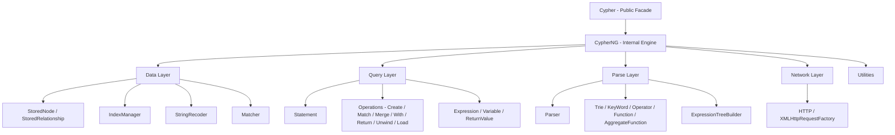
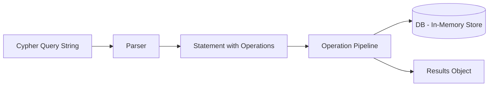
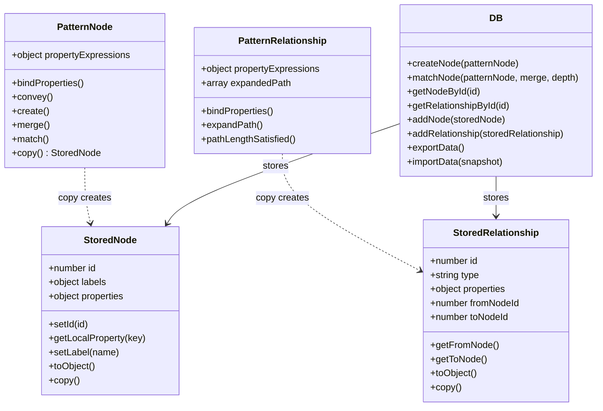

# CypherNG Architecture Design Document

## 1. Overview

`CypherNG.js` is a refactored version of `Cypher.js` — an in-memory Cypher query engine for JavaScript. The refactored module maintains **full behavioral parity** with the original while introducing clean separation of concerns to enable future persistence layer integration.

### High-Level Component Relationships



### Data Flow



---

## 2. Section Organization

The single `CypherNG.js` file will be organized into clearly delimited sections using block comments. Each section boundary is marked with a banner comment.

```
// ============================================================
// CypherNG.js — Cypher Query Engine for JavaScript
// ============================================================

// === LICENSE HEADER ===

// === SECTION 1: UTILITIES ===
//   addArrayFunctions, addAssociativeArrayFunctions, clean,
//   NodeReference, RelationshipReference, printStackTrace

// === SECTION 2: DATA LAYER ===
//   StringRecoder, IDFactory, StoredNode, StoredRelationship,
//   PatternNode, PatternRelationship, Pattern,
//   IndexManager, Matcher, DB,
//   Constant, List, AssociativeArray, Case, Predicate, FString,
//   Table, TableColumn

// === SECTION 3: NETWORK LAYER ===
//   XMLHttpRequestFactory, HTTP

// === SECTION 4: QUERY LAYER ===
//   Expression, Variable, Statement, Where,
//   OperationBase, Create, Match, Merge,
//   Return, With, Unwind, Load,
//   GroupBy, ReturnValue, Setter, Inserter

// === SECTION 5: PARSE LAYER ===
//   Trie, KeyWord, Operator, _Function, AggregateFunction,
//   PredicateFunctionLookup,
//   Parser (includes ExpressionTreeBuilder,
//           VariableReference, ExpressionElement,
//           AggregateExpressionElement)

// === SECTION 6: ENGINE ===
//   CypherNG() — internal engine constructor

// === SECTION 7: PUBLIC FACADE ===
//   Cypher(options) — public API with environment detection

// === SECTION 8: EXPORT ===
//   try { module.exports = Cypher; } catch(e) { ; }
```

### Why this order?

1. **Utilities first** — no dependencies, used by everything
2. **Data Layer** — depends only on Utilities
3. **Network Layer** — standalone, used by Load operation
4. **Query Layer** — depends on Data Layer and Utilities
5. **Parse Layer** — depends on Data, Query, and Utilities
6. **Engine** — orchestrates all layers
7. **Public Facade** — wraps the engine
8. **Export** — CommonJS with browser fallback

---

## 3. Class/Constructor Redesign

### 3.1 Entity Separation: StoredNode vs PatternNode

**Problem:** The current `Node` constructor serves dual roles — it is both a *stored entity* in the database and a *pattern descriptor* used during parsing/matching. This makes nodes non-serializable due to closure-captured `_db`, `propertyExpressions`, `previousObject`/`nextObject` references, and pattern-matching state like `matchedNode`.

**Solution:** Split into two distinct constructors:

#### `StoredNode`
Pure data entity stored in DB. No closures over `db`. No pattern-matching state.

```
StoredNode:
  - id: number
  - labels: object  (e.g., {Person: true, Actor: true})
  - properties: object  (e.g., {name: "Alice", age: 30})

  Methods:
  - setId(id), id()
  - setLabel(name), hasLabel(name), getLabels(), labels()
  - setProperty(key, value), getLocalProperty(key), setProperties(obj)
  - getProperties(), getRawProperties(), hasProperties(), hasLabels()
  - toObject() → plain serializable representation
  - get() → returns NodeReference
  - copy() → new StoredNode with same data
  - type() → "StoredNode"
```

#### `PatternNode` (extends/composes behavior)
Used during parsing and query execution. Holds pattern-matching state, expression bindings, and linked-list navigation. **Not stored in DB.**

```
PatternNode:
  - db: reference (for matchNode/createNode delegation)
  - propertyExpressions: object  (expression closures)
  - labels: object
  - properties: object

  Pattern navigation:
  - previousObject, nextObject, pattern
  - nextNode(), previousNode(), incomingRelationship(), outgoingRelationship()

  Pattern matching state:
  - variableKey, referredNode, expandedNode
  - matchedNode
  - matchedIncomingRelationshipIds

  Methods:
  - bindProperty(key), bindProperties()
  - setReferredNode(), isReferred(), getReferredNode()
  - setExpandedNode(), isExpanded(), getExpandedNode()
  - addMatchedNode(), getMatchedNode(), getData()
  - convey(), create(), merge(), match()
  - copy() → creates a StoredNode (not a PatternNode)
  - nextAction(), setNextAction()
  - mappable()
```

The same split applies to `StoredRelationship` vs `PatternRelationship`.

#### `StoredRelationship`
```
StoredRelationship:
  - id: number
  - type: string
  - properties: object
  - fromNodeId: number  (not a Node reference — just the ID)
  - toNodeId: number    (not a Node reference — just the ID)
  - leftDirection: boolean
  - rightDirection: boolean

  Methods:
  - setId(id), id()
  - setType(type), getType(), setStoredType(type)
  - setProperty(key, value), getProperty(key), setProperties(obj), getProperties()
  - getLocalProperty(key)
  - setFromNode(node), getFromNode(fromNodeId), setToNode(node), getToNode(fromNodeId)
  - leftDirection(fromNodeId), rightDirection(fromNodeId), uniDirectional(), direction()
  - toObject(), get() → RelationshipReference
  - copy() → new StoredRelationship
  - type() → "StoredRelationship"
```

**Key change:** `StoredRelationship` stores `fromNodeId` and `toNodeId` as plain numbers. The `getFromNode()`/`getToNode()` methods retrieve the actual `StoredNode` via the DB reference *only when called at runtime* (through a resolver function injected at construction, not a closure over `db`).

#### `PatternRelationship`
Holds all the pattern-matching state: `expandedPath`, `pathList`, `visitedNodes`, `matchedRelationship`, `expandedEndNode`, `propertyExpressions`, linked-list navigation, etc.

### 3.2 DB Constructor

**Current:** `DB(engine)` — receives the engine and calls `engine.statement()` to update stats.

**New:** `DB(statsCallback)` — receives a lightweight callback object instead of the full engine.

```javascript
// Instead of:
const db = new DB(this);  // this = engine
// engine.statement().setNodesAdded(...)

// Use:
const db = new DB({
  onNodeAdded: () => { /* increment counter in statement */ },
  onRelationshipAdded: () => { /* increment counter in statement */ }
});
```

This breaks the circular dependency: DB no longer knows about engine or statement.

### 3.3 NodeReference / RelationshipReference

**Current:** Both capture `_db` in a closure.

**New:** They continue to hold a `db` reference (this is necessary for runtime property lookups), but `db` itself is now serialization-friendly. The reference pattern remains the same — these are lightweight proxy objects that delegate to DB for actual data retrieval.

### 3.4 StringRecoder

**See Section 4.4** for the detailed strategy.

### 3.5 Pattern

Remains largely unchanged. It orchestrates a linked list of PatternNodes and PatternRelationships.

### 3.6 KeyWord, Operator, _Function, AggregateFunction

**Problem:** Static mutable state — `KeyWord.latestParsed`, `Operator.latestParsed`, etc.

**Solution:** Move `latestParsed` into the Parser instance state. The `Trie.isF()` method will return the matched function object directly rather than setting it as a side effect.

```javascript
// Current:
Trie.isF(KeyWord, KeyWord.trie, expression, position);
// sets KeyWord.latestParsed as side effect

// New:
const result = Trie.isF(KeyWord.trie, expression, position);
// returns { length: N, matched: functionObj } or { length: 0, matched: null }
```

This eliminates global mutable state and makes the parser re-entrant safe (important if multiple parse operations ever run concurrently).

### 3.7 LinkedList

**Status:** Unused — the `toArray()` method has a bug (calls `currentNode.next()` without assignment) and no code references `LinkedList`. **Remove entirely.**

---

## 4. DB Layer Redesign

### 4.1 Separation of Stored Entities from Pattern Entities



### 4.2 Index Management Strategy

Extract index management into an `IndexManager` (or keep it as organized internal functions within DB — both are acceptable for a single-file module). The key indexes are:

| Index | Key Structure | Purpose |
|-------|--------------|---------|
| `nodeIdLookup` | `[recodedKey][recodedValue] → [nodeId, ...]` | Property-value → node ID lookup |
| `labelNodeIdLookup` | `[recodedLabel] → [nodeId, ...]` | Label → node ID lookup |
| `relationshipLookup` | `[fromNodeId][toNodeId] → [relId, ...]` | From-to → relationship ID lookup |
| `relationshipIdsByNodeIdLookup` | `[nodeId] → [relId, ...]` | Outgoing relationships by node |
| `relationshipIdsByNodeIdLookupIncoming` | `[nodeId] → [relId, ...]` | Incoming relationships by node |
| `relationshipIdLookup` | `[recodedKey][recodedValue] → [relId, ...]` | Property-value → relationship ID lookup |
| `typeRelationshipIdLookup` | `[recodedType] → [relId, ...]` | Type → relationship ID lookup |

**Rebuild Strategy:** All indexes can be rebuilt from raw `StoredNode[]` and `StoredRelationship[]` arrays. The rebuild function iterates all stored entities and re-populates each index. This is critical for persistence: on import, indexes are rebuilt rather than serialized.

```javascript
// Inside DB:
const rebuildIndexes = function() {
  // Clear all indexes
  nodeIdLookup = {};
  labelNodeIdLookup = {};
  relationshipLookup = {};
  // ... etc.

  // Rebuild from stored entities
  for (const node of nodes) {
    if (!node) continue;
    for (const key in node.getRawProperties()) {
      addLookupNodeId(key, node.getLocalProperty(key), node.id());
    }
    for (const label in node.labels()) {
      addLabelNodeIdLookup(label, node.id());
    }
  }
  for (const rel of relationships) {
    if (!rel) continue;
    addLookupRelationship(rel.fromNodeId, rel.toNodeId, rel.id());
    // ... etc.
  }
};
```

### 4.3 Import/Export Interface

```javascript
// Export: serialize current DB state
this.exportData = function() {
  return {
    nodes: nodes
      .filter(n => n != null)
      .map(n => ({
        id: n.id(),
        labels: n.labels(),
        properties: n.getRawProperties()
      })),
    relationships: relationships
      .filter(r => r != null)
      .map(r => ({
        id: r.id(),
        type: r.getType(),
        properties: r.getProperties(),
        fromNodeId: r.fromNodeId,
        toNodeId: r.toNodeId,
        leftDirection: r.leftDirectionRaw(),
        rightDirection: r.rightDirectionRaw()
      })),
    meta: {
      nodeIdFactory: NODE_ID_FACTORY,
      relationshipIdFactory: RELATIONSHIP_ID_FACTORY
    }
  };
};

// Import: restore DB from serialized snapshot
this.importData = function(snapshot) {
  // Clear current state
  nodes = [];
  relationships = [];
  NODE_ID_FACTORY = snapshot.meta.nodeIdFactory;
  RELATIONSHIP_ID_FACTORY = snapshot.meta.relationshipIdFactory;

  // Reconstruct StoredNodes
  for (const nd of snapshot.nodes) {
    const n = new StoredNode();
    n.setId(nd.id);
    n.setProperties(nd.properties);
    n.setLabelsFromObject(nd.labels);
    nodes[nd.id] = n;
  }

  // Reconstruct StoredRelationships
  for (const rd of snapshot.relationships) {
    const r = new StoredRelationship(nodeResolver);
    r.setId(rd.id);
    r.setStoredType(rd.type);
    r.setProperties(rd.properties);
    r.setFromNodeId(rd.fromNodeId);
    r.setToNodeId(rd.toNodeId);
    r.setLeftDirection(rd.leftDirection);
    r.setRightDirection(rd.rightDirection);
    relationships[rd.id] = r;
  }

  // Rebuild all indexes from raw data
  rebuildIndexes();
};
```

### 4.4 StringRecoder Strategy

**Decision: Keep StringRecoder, make it rebuildable.**

The StringRecoder maps string values to integer codes for fast index lookups. This is a performance optimization that allows all index keys to be integer-based.

**Strategy:**
- StringRecoder is **not** serialized with DB exports.
- On import, StringRecoder is **rebuilt** automatically as indexes are rebuilt — each call to `recode()` during `rebuildIndexes()` re-creates the trie.
- This means exported data uses raw string keys, and index keys are recoded during import.
- The StringRecoder instance remains internal to DB — other components only interact with it through DB methods.

**Alternative considered and rejected:** Removing StringRecoder entirely and using raw strings as index keys. This would simplify the code but degrade performance for large datasets where the same string appears many times as an index key. The recoder provides a net benefit and the rebuild cost on import is acceptable.

---

## 5. Operation Pipeline Redesign

### 5.1 Current Duplication

`Create`, `Match`, and `Merge` share nearly identical structures:

| Method | Create | Match | Merge |
|--------|--------|-------|-------|
| `where()` | ✅ | ✅ | ✅ |
| `addPattern()` | ✅ | ✅ | ✅ |
| `addNode()` | ✅ | ✅ | ✅ |
| `addRelationship()` | ✅ | ✅ | ✅ |
| `variable()` | ✅ | ✅ | ✅ (+ setVariableKey) |
| `getLast()` | ✅ | ✅ | ✅ |
| `setPreviousOperation()` | ✅ | ✅ | ✅ |
| `setNextOperation()` | ✅ | ✅ | ✅ |
| `initialiseConveyorBelt()` | ✅ (identical) | ✅ (identical) | ✅ (identical) |
| `doIt()` | differs | differs | differs |
| `finish()` | ✅ (identical) | differs (has pattern.finish) | ✅ (identical) |
| `run()` | differs | differs | differs |
| `variables()` | ✅ (identical) | ✅ (identical) | ✅ (identical) |

### 5.2 Proposed: GraphOperation Base

Create a shared constructor or factory that provides the common structure:

```javascript
function GraphOperation(statement) {
  const patterns = [];
  let previousOperation;
  let nextOperation;
  let whereCondition;

  this.where = function(expression) {
    whereCondition = new Where(expression);
  };
  this.addPattern = function() {
    patterns.push(new Pattern());
  };
  this.getPattern = function() {
    return patterns[patterns.length - 1];
  };
  this.addNode = function(node) {
    this.getPattern().addNode(node);
  };
  this.addRelationship = function(relationship) {
    this.getPattern().addRelationship(relationship);
  };
  this.getLast = function() {
    return this.getPattern().lastObject();
  };
  this.variable = function(key) {
    statement.addVariable(key, this.getLast());
  };
  this.setPreviousOperation = function(op) {
    previousOperation = op;
  };
  this.setNextOperation = function(op) {
    nextOperation = op;
    op.setPreviousOperation(this);
  };
  this.previousOperation = function() {
    return previousOperation;
  };
  this.variables = function() {
    return statement.variables();
  };
  this.patterns = function() {
    return patterns;
  };
  this.nextOperation = function() {
    return nextOperation;
  };
  this.whereConditionMet = function() {
    return !whereCondition || whereCondition.evaluate();
  };
  this.initialiseConveyorBelt = function() {
    if (nextOperation) {
      this.getPattern().setNextAction(function() {
        if (!whereCondition || whereCondition.evaluate()) {
          const result = nextOperation.doIt();
          if (result instanceof Promise) {
            result.then();
          }
        }
      });
    }
  };
  this.defaultFinish = function() {
    if (nextOperation) {
      nextOperation.finish();
    } else {
      statement.success();
    }
  };
}
```

Then `Create`, `Match`, and `Merge` only define their differing behavior:

```javascript
function Create(statement) {
  GraphOperation.call(this, statement);

  this.doIt = function() { /* Create-specific logic */ };
  this.finish = this.defaultFinish;
  this.run = function() { /* Create-specific run */ };
  this.type = function() { return 'Create'; };
}

function Match(statement) {
  GraphOperation.call(this, statement);

  this.doIt = function() { /* Match-specific logic */ };
  this.finish = function() {
    // Match has pattern.finish() calls
    const patterns = this.patterns();
    const next = this.nextOperation();
    if (next) {
      for (const p of patterns) p.finish();
      next.finish();
    } else {
      statement.success();
    }
  };
  this.run = function() { /* Match-specific run */ };
  this.type = function() { return 'Match'; };
}

function Merge(statement) {
  GraphOperation.call(this, statement);

  // Override variable to also set variableKey
  const baseVariable = this.variable;
  this.variable = function(key) {
    this.getLast().setVariableKey(key);
    baseVariable.call(this, key);
  };

  this.doIt = function() { /* Merge-specific logic */ };
  this.finish = this.defaultFinish;
  this.run = function() { /* Merge-specific run */ };
  this.type = function() { return 'Merge'; };
}
```

### 5.3 With Extending Return

The current pattern where `With` creates a `Return` and overrides methods is clever but confusing. Keep the same approach (it works and maintains parity) but document it clearly:

```javascript
// With extends Return by delegation, overriding
// setReturnValueNextAction to set variable overrides
// instead of writing to output.
```

---

## 6. Error Handling Strategy

### 6.1 Categories of Current Silent Catches

| Location | Current Behavior | New Behavior |
|----------|-----------------|-------------|
| `Variable.value()` catch | Silently returns `null` | **Keep** — legitimate fallback for unresolved variable access |
| `XMLHttpRequestFactory()` catch | Falls through to Node.js impl | **Keep** — this is environment detection |
| `DB.addNode` → `engine.statement()` | Crashes if engine is null | **Eliminated** — stats via callback |
| `Setter` property/type catch | Silently swallows | **Log warning** via configurable error handler |
| `clean()` processing | No catch needed | **Keep as-is** |
| `_Function.f.keys` catch | Falls back to Object.keys | **Keep** — legitimate fallback |
| `_Function.f.object_lookup` catch | Silently returns null | **Keep** — property access may fail |
| `_Function.f.array_lookup` catch | Silently returns null | **Keep** — index may be out of bounds |
| `_Function.f.tostring` catch | Falls back to concatenation | **Keep** — legitimate fallback |
| `_Function.f.stringify` catch | Returns null | **Keep** — JSON.stringify may fail on circular refs |
| `Statement.getVariable` → `window` check | Silently swallows | **Keep** — environment detection |

### 6.2 Error Handler Pattern

```javascript
// Inside CypherNG, configurable error handler:
let errorHandler = {
  warn: function(message, context) {
    // Default: console.warn in development, noop in production
    try { console.warn('[CypherNG]', message, context); } catch(e) { /* noop */ }
  },
  error: function(message, context) {
    throw message;
  }
};

this.setErrorHandler = function(handler) {
  errorHandler = Object.assign(errorHandler, handler);
};
```

### 6.3 Principles

1. **Parsing errors** — always throw with descriptive messages including parse position (already done well)
2. **Runtime query errors** — throw with context (type mismatches, missing variables)
3. **Data operations** — use configurable handler for non-critical failures
4. **Environment detection** — keep silent catches (they are correct design)
5. **Never swallow errors that indicate bugs** — e.g., the Setter catch that hides property assignment failures should log

---

## 7. Migration Compatibility

### 7.1 Public API Surface

The `Cypher(options)` constructor must maintain these exact signatures:

```javascript
const engine = new Cypher();
const engine = new Cypher({ runInWebWorker: true });
const engine = new Cypher({ dataDownloadProxy: "http://..." });

engine.execute(statementText, successCallback, errorCallback);
engine.addGraph(nodes, edges);
engine.resetDataBase();
```

### 7.2 Results Format

The `results` object returned to `successCallback` must be identical:

```javascript
{
  output: [ { key: value, ... }, ... ],
  graph: {
    nodes: [ { id, labels, properties }, ... ],
    links: [ { id, type, properties, source, target, ... }, ... ]
  },
  stats: {
    nodesAdded: N,
    relationshipsAdded: N
  }
}
```

### 7.3 `addGraph` Input Format

The `addGraph(nodes, edges)` method accepts:

```javascript
nodes: [
  { id: N, properties: {...}, labels: {...} },
  ...
]
edges: [
  { id: N, from: nodeId, to: nodeId, properties: {...}, type: "TYPE" },
  ...
]
```

### 7.4 Internal Compatibility

All Cypher language features must behave identically:

- `CREATE`, `MATCH`, `MERGE`, `WITH`, `RETURN`, `UNWIND`, `LOAD CSV/JSON/TEXT`
- `WHERE`, `SET`, `LIMIT`, `DISTINCT`, `AS`, `INTO`
- Variable-length path expansion (`*`, `*..N`, `*N..M`)
- `shortestpath()`
- All functions: `count`, `collect`, `sum`, `min`, `max`, `stdev`, `barchart`, `histogram`
- All scalar functions: `id`, `labels`, `type`, `size`, `nodes`, `relationships`, `head`, `last`, `keys`, `properties`, `exists`, `startnode`, `endnode`
- Math: `round`, `rand`, `sqrt`, `log`, `ln`, `sin`, `cos`, `exp`, `PI`, `E`
- String: `lower`, `upper`, `replace`, `split`, `join`, `trim`, `tostring`, `toint`, `tofloat`, `tojson`, `todate`, `stringify`
- `range`, `coalesce`, `not`, `timestamp`
- `CASE WHEN THEN ELSE END`
- Predicate functions: `all`, `any`, `sum` (predicate variant)
- Operators: `+`, `-`, `*`, `/`, `%`, `^`, `=`, `<>`, `<`, `>`, `<=`, `>=`, `AND`, `OR`, `IN`, `IS`, `|`, `&`
- Comments (`//`)
- F-strings (`f"..."`)

### 7.5 Constructor Names for instanceof Checks

The codebase uses `.constructor == Node`, `.constructor == Relationship`, etc. extensively. CypherNG must ensure that equivalent checks work:

- Where code checks `constructor == Node`, CypherNG will check `constructor == PatternNode || constructor == StoredNode`, or use a `isNode()` method.
- **Critical:** The `clean()` function and Statement's `addOutputEntryToGraph` check `constructor == NodeReference` and `constructor == RelationshipReference`. These constructors must keep the same identity.

### 7.6 Export Pattern

```javascript
try {
  module.exports = Cypher;
} catch (e) {
  ;
}
```

---

## 8. Persistence Integration Points

### 8.1 DB.exportData / DB.importData

**Location:** Inside `DB` constructor, as public methods.

```javascript
// Future persistence adapter interface:
const adapter = {
  save: async function(snapshot) { /* write to IndexedDB/file/remote */ },
  load: async function() { /* read from IndexedDB/file/remote */ return snapshot; }
};

// Usage:
const snapshot = db.exportData();
await adapter.save(snapshot);

// Later:
const restored = await adapter.load();
db.importData(restored);
```

### 8.2 Stats Callback Decoupling

**Location:** `DB` constructor parameter.

The stats callback pattern (`{onNodeAdded, onRelationshipAdded}`) means DB operations can be tracked externally — a persistence layer could hook into these to implement write-ahead logging or change tracking.

### 8.3 StoredNode / StoredRelationship Serialization

**Location:** Entity constructors.

Both `StoredNode` and `StoredRelationship` are designed to be serializable to JSON:

```javascript
// StoredNode serialization:
JSON.stringify({
  id: node.id(),
  labels: node.labels(),
  properties: node.getRawProperties()
});

// StoredRelationship serialization:
JSON.stringify({
  id: rel.id(),
  type: rel.getType(),
  properties: rel.getProperties(),
  fromNodeId: rel.fromNodeId,
  toNodeId: rel.toNodeId
});
```

No closures, no circular references, no function-valued properties in the serialized form.

### 8.4 Index Rebuild on Import

**Location:** `DB.rebuildIndexes()` — called at the end of `importData()`.

A persistence layer only needs to store raw entities. Indexes are always derived data and can be rebuilt efficiently.

### 8.5 StringRecoder Transparency

**Location:** Internal to DB and GroupBy.

StringRecoder is an internal optimization. Persistence layers never see recoded values — they work with raw strings. On import, the recoder naturally rebuilds as index population calls `recode()`.

### 8.6 Delete Operations (Future Hook)

**Location:** DB constructor — new methods.

```javascript
// Future: deletion support
this.deleteNode = function(nodeId) {
  // Remove from nodes array
  // Remove from all indexes
  // Remove dangling relationships
  // Call onNodeDeleted callback if registered
};

this.deleteRelationship = function(relationshipId) {
  // Remove from relationships array
  // Remove from all indexes
  // Call onRelationshipDeleted callback if registered
};
```

These are not implemented in this refactor (to maintain behavioral parity) but the architecture supports adding them without structural changes.

### 8.7 Change Tracking (Future Hook)

**Location:** DB constructor.

```javascript
// Future: change tracking for incremental persistence
const changeLog = [];

// Inside addNode:
changeLog.push({ type: 'ADD_NODE', nodeId: node.id(), timestamp: Date.now() });

// Expose for persistence layer:
this.getChangeLog = function() { return changeLog; };
this.clearChangeLog = function() { changeLog.length = 0; };
```

---

## 9. Design Decisions Log

### D1: Keep Single-File Structure
**Decision:** CypherNG remains a single file with section comments, not split into modules.
**Rationale:** Maintains deployment simplicity. The original works in browsers without bundlers. Splitting would require a build step. Section comments provide adequate organization.

### D2: Constructor Functions, Not ES6 Classes
**Decision:** Continue using constructor functions with `this` methods, not ES6 `class` syntax.
**Rationale:** Behavioral parity requires that `.constructor` checks work identically. ES6 classes behave differently with respect to hoisting and `constructor` property chains. Using constructor functions with prototype-based inheritance (for AggregateExpressionElement) matches the original.

### D3: Split Node/Relationship Into Stored vs Pattern
**Decision:** Create separate `StoredNode`/`PatternNode` and `StoredRelationship`/`PatternRelationship` constructors.
**Rationale:** This is the single most important change for persistence. Stored entities must be serializable — no closures over `db`, no expression bindings, no pattern navigation chains. Pattern entities are ephemeral and only exist during query execution. The `copy()` method on PatternNode creates a StoredNode, which is what gets added to the DB.

### D4: Decouple DB from Engine via Callbacks
**Decision:** Replace `DB(engine)` with `DB(statsCallback)`.
**Rationale:** The engine→DB→engine circular dependency prevents clean separation. DB only needs engine to increment `nodesAdded`/`relationshipsAdded` counters. A callback object breaks this cycle while preserving exact behavior.

### D5: Keep StringRecoder, Make It Rebuildable
**Decision:** Do not serialize StringRecoder. Rebuild it on import.
**Rationale:** The recoder is a performance optimization that converts strings to integers for index keys. Serializing the trie would be complex and fragile. Since all indexes are rebuilt on import, the recoder naturally rebuilds during that process. The overhead is negligible compared to the import itself.

### D6: Eliminate Static Mutable State in Parser
**Decision:** Move `latestParsed` from constructor-level statics into Parser instance state.
**Rationale:** Static mutable state is a code smell that prevents future multi-instance parsing. The fix is simple: `Trie.isF()` returns the matched object instead of setting it on the constructor.

### D7: Remove IE Polyfills
**Decision:** Remove the `IE_FIX` block entirely (`Object.values`, `Object.keys`, `Array.prototype.fill`, `Array.prototype.concat`, `Number.MAX_SAFE_INTEGER`).
**Rationale:** All target environments (modern browsers, Node.js) support these natively. The global prototype modifications are a potential source of conflicts.

### D8: Remove LinkedList
**Decision:** Remove the `DataStructures` section containing `LinkedList`.
**Rationale:** `LinkedList` is never referenced anywhere in the codebase. Its `toArray()` method has a bug (doesn't advance the pointer). Dead code removal.

### D9: GraphOperation Base for Create/Match/Merge
**Decision:** Extract shared code into a `GraphOperation` base constructor.
**Rationale:** Reduces ~180 lines of duplicated code. Each operation inherits common behavior and only defines its unique `doIt()`, `finish()`, and `run()` methods. `Merge.variable()` overrides the base to also set variableKey.

### D10: Keep `var` → `let`/`const` Migration Conservative
**Decision:** Use `const` for values that are never reassigned, `let` for mutable variables. Do not change semantics.
**Rationale:** JavaScript's `let`/`const` have block scoping vs `var`'s function scoping. The labeled blocks (`Data:`, `Network:`, etc.) already create no scope in the original. With `let`/`const`, this remains true. However, care must be taken with `for` loops where `var` creates a single binding vs `let` creating per-iteration bindings. Each case must be verified during implementation.

### D11: StoredRelationship Stores Node IDs, Not Node References
**Decision:** `StoredRelationship` stores `fromNodeId: number` and `toNodeId: number` instead of direct `Node` references.
**Rationale:** Direct node references create circular structures (node → relationship → node) that prevent serialization. Storing IDs and resolving through DB at runtime breaks the cycle. A `nodeResolver` function is injected so `getFromNode()`/`getToNode()` still work transparently.

### D12: Preserve With's Delegation Pattern
**Decision:** Keep `With` as a function that creates and customizes a `Return` instance.
**Rationale:** This unusual pattern is deeply embedded in how the operation pipeline works. `With` is a `Return` that overrides `setReturnValueNextAction` and sets `isIntermediary`. Changing this would risk subtle behavioral differences. Adding clear documentation is sufficient.

### D13: Do Not Implement Delete Operations
**Decision:** Design the architecture to support deletion but do not implement `deleteNode`/`deleteRelationship`.
**Rationale:** The original has no deletion. Adding it would break behavioral parity. The DB layer is designed so deletion can be added later by removing from arrays and rebuilding affected indexes.

### D14: Keep Parser as Monolithic Constructor
**Decision:** Do not split the Parser into separate tokenizer/parser modules.
**Rationale:** The recursive descent parser is tightly coupled — the tokenizer functions (`check`, `currentChar`, `numeric`, etc.) are used inline within parsing functions. Separating them would require passing significant state back and forth. The Parser with its embedded ExpressionTreeBuilder is well-structured internally, just large.

---

## 10. Implementation Approach Summary

The implementation should proceed in the following order to minimize risk:

1. **Utilities section** — copy and modernize `var` → `let`/`const`
2. **StoredNode / StoredRelationship** — extract pure data entity constructors
3. **PatternNode / PatternRelationship** — adapt pattern constructors to delegate to stored entities
4. **DB** — rewrite with stats callback, import/export, rebuildIndexes
5. **IndexManager logic** — keep inside DB but organize clearly
6. **Data types** — Pattern, List, AssociativeArray, Constant, Case, Predicate, FString, Table, TableColumn
7. **Network** — copy with minor cleanup
8. **Query operations** — GraphOperation base, then Create, Match, Merge, Return, With, Unwind, Load, Setter, Inserter, GroupBy
9. **Expression / Variable / ReturnValue / Where** — port with `let`/`const`
10. **Parse layer** — Trie, KeyWord, Operator, _Function, AggregateFunction, PredicateFunctionLookup, Parser, ExpressionTreeBuilder
11. **Engine** — CypherNG constructor wiring everything together
12. **Public Facade** — Cypher(options) with environment detection
13. **Export** — CommonJS with browser fallback
14. **Verification** — run existing test suite against CypherNG
